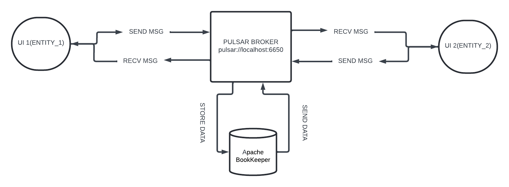

Certainly! Here's how you can integrate the architecture diagram into your README:

---

# Chat Application with Apache Pulsar

## Overview

This project is a simple chat application using Apache Pulsar for messaging, with a Java Swing GUI. It consists of two separate Java applications that act as producers and consumers. Each application can send and receive messages through Pulsar.

## Architecture

The following diagram illustrates the communication flow between the two entities using Apache Pulsar:

 <!-- Replace with the path to your uploaded image -->

- **Entity 1**: Sends messages to Pulsar and also gets replies from entity2 through pulsars.
- **Entity 2**: Receives messages from Pulsar and sends replies back through Pulsar.
- **Pulsar**: Acts as the messaging middleware, facilitating communication between Entity 1 and Entity 2.

## Requirements

- Docker
- Maven
- apache-pulsar
- Java Development Kit (JDK) 22
- IntelliJ IDEA (or any IDE with Maven support)

## Setup Instructions

### 1. Run Apache Pulsar in Docker

1. **Pull the Pulsar Docker Image**:
   Open a terminal and run:
   ```bash
   docker pull apachepulsar/pulsar:latest
   ```

2. **Start Pulsar in Standalone Mode**:
   Run the following command to start Pulsar in standalone mode:
   ```bash
   docker run -it --rm -p 6650:6650 -p 8080:8080 apachepulsar/pulsar:latest bin/pulsar standalone
   ```
   - Port `6650` is used for Pulsar client connections.
   - Port `8080` is used for the Pulsar admin API.

### 2. Setup Maven Dependencies

1. **Create a Maven Project**:
   If you haven’t already, create a new Maven project in your IDE (e.g., IntelliJ IDEA).

2. **Add Dependencies**:
   Update your `pom.xml` file to include the necessary Pulsar dependencies. A sample `pom.xml` configuration is provided in the project repository.

### 3. Create and Configure Java Files

1. **Create the UI1 (Entity 1) File**:
   Save the file as `ChatUI.java`. This file contains the producer and consumer logic for the first entity.

2. **Create the UI2 (Entity 2) File**:
   Save the file as `ChatUI2.java`. This file contains the producer and consumer logic for the second entity.

### 4. Build and Run the Project

1. **Build the Project**:
   In your terminal, navigate to the project directory and run:
   ```bash
   mvn clean install
   ```

2. **Run Entity 1**:
   Launch the `ChatUI` application:
   ```bash
   mvn exec:java -Dexec.mainClass="org.example.ChatUI"
   ```

3. **Run Entity 2**:
   Launch the `ChatUI2` application:
   ```bash
   mvn exec:java -Dexec.mainClass="org.example.ChatUI2"
   ```
    <!-- Add image if available -->

You should now have two chat applications running, each with its own GUI. Messages sent from one application should appear in the other.

## Troubleshooting

- **Pulsar Connection Issues**: Ensure Pulsar is running and accessible at the specified `SERVICE_URL`.
- **Dependency Issues**: Verify that Maven dependencies are correctly added to `pom.xml` and run `mvn clean install` to refresh the dependencies.

## License

This project is licensed under the MIT License. See the [LICENSE](LICENSE) file for details.

---

Make sure to replace `path_to_your_image.png` with the actual path to the architecture diagram image you upload. This README provides a comprehensive guide with visual aids to help users understand the setup and architecture.
